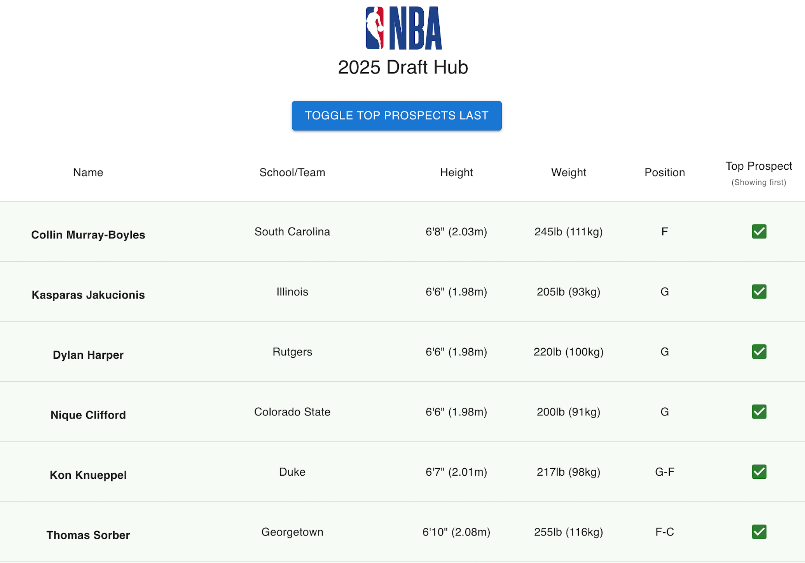

[![alex-linkedin-shield]][alex-linkedin-url]

## Table of Contents

[About](#about) |
[Screenshots](#screenshots) |
[Built With](#built-with) |
[Local Project Setup](#local-project-setup) |
[Clone the repo](#clone-the-repo) |
[Contact](#contact)

## About

Find draft prospects and learn more about them. Write scout reports and see highlights from their games.

## Screenshots

Board                           |         Player Profile UI
:--------------------------------------:|:-------------------------:
  |  

## Built With

[![React.JS]][React-url][![MaterialUI]][MUI-url][![Hono]][Hono-url][![TypeScript]][Typescript-url]

<div align='right'>

[Back to Top](#top)

</div>

## Local Project Setup

Git, Node.js, and PNPM (or your package manager of choice) are required to run this project locally. 

### Clone the repo

Copy this and run it in your terminal:

```bash
git clone https://github.com/AlexVCS/draft-hub.git
cd draft-hub
pnpm i
```

Run the app by running `pnpm run dev` in one terminal and `pnpm run serve` in another terminal. Then open the UI of the app at `http://localhost:5173`

## Contact

Alex Curtis-Slep - [GitHub](https://github.com/AlexVCS) / [Bluesky](https://bsky.app/profile/alexcurtisslep.bsky.social) / alexcurtisslep@gmail.com

<div align='right'>

[Back to Top](#top)

</div>

[alex-linkedin-shield]: https://img.shields.io/badge/-Alex's_LinkedIn-black.svg?style=for-the-badge&logo=linkedin&colorB=555
[alex-linkedin-url]: https://www.linkedin.com/in/alexcurtisslep/
[Hono]: https://img.shields.io/badge/Hono-black?style=for-the-badge&logo=hono
[MaterialUI]: https://img.shields.io/badge/Material--UI-0081CB?style=for-the-badge&logo=material-ui&logoColor=white
[MUI-url]: https://mui.com/
[Hono-url]: https://hono.dev/
[React.js]: https://img.shields.io/badge/React-20232A?style=for-the-badge&logo=react&logoColor=61DAFB
[React-url]: https://reactjs.org/
[Typescript]: https://img.shields.io/badge/typescript-%23007ACC.svg?style=for-the-badge&logo=typescript&logoColor=white
[Typescript-url]: https://www.typescriptlang.org/
